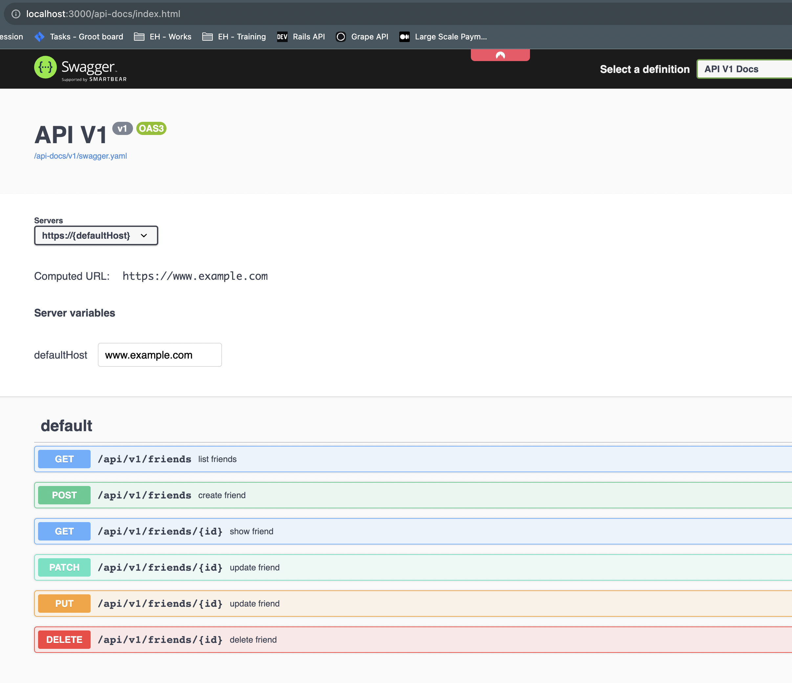

# README

This repository aims to provide a practical way to implement `rails-api` with rails 7.0.

Which simulates a CRUD `friends-contact` application that can retrieve batch of friends or a specific friend info.

This repository use gem `rswag` for generate swagger docs & ui by the following steps:
  - refer to https://github.com/rswag/rswag for standard documentation.
  - notes:
    - we must install & generate rspec files first:
      - `bundle exec rails generate rspec:install`
    - in order to generate swagger.yaml file:
      - `bundle exec rails rswag RAILS_ENV=test`

Retrieve swagger docs via: http://localhost:3000/api-docs

References:
  - https://dev.to/nemwelboniface/api-with-rails-7-ngh
  - https://github.com/rswag/rswag
